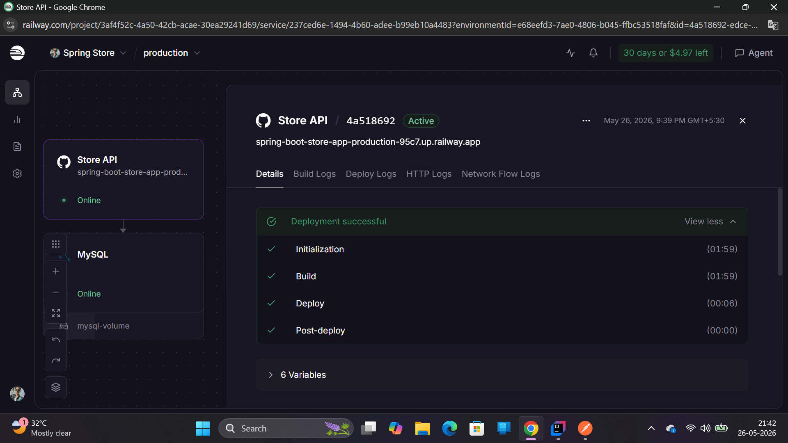
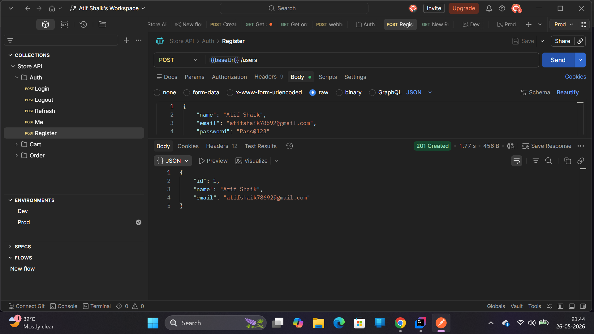

# 🛒 Store API — Enterprise E-Commerce & Payment Engine

A robust, production-grade, full-stack capable backend REST API engineered using **Java 21**, **Spring Boot**, and **MySQL**. This application features an enterprise-grade database schema architecture, asynchronous third-party webhook transaction processors, performance-optimized object-relational mapping pipelines, and secure cloud environment separation.

---

## 🛠️ Tech Stack & Technical Competencies

* **Backend Engine:** Java 21 LTS, Spring Boot 3.x (Web, Data JPA, Security)
* **Database & Persistence:** MySQL, Hibernate ORM, Flyway Schema Migrations
* **Payment Architecture:** Razorpay REST SDK, Enterprise Webhook Signature Verification
* **Cloud Infrastructure:** Railway Cloud Platform, Centralized OS Environment Configuration
* **Testing & Tools:** Postman Client API Suites, Ngrok Secure HTTP Tunnels, Slf4j Logging

---

## 🚀 Key Architectural Highlights

### 1. Robust Three-Stage Payment Gateway Pipeline
Engineered an end-to-end secure electronic transaction sequence mimicking massive real-world retail handlers:
* **Stage 1 (Intent Initiation):** Server-side currency decimal safety conversion ($Currency \times 100$ paise mapping constraints) to securely establish unique upstream transaction tokens.
* **Stage 2 (Instrument Simulation):** Built a modular testing environment ensuring decoupled validation execution loops.
* **Stage 3 (Asynchronous Webhook Settlement):** Implemented an exception-guarded, signature-verified webhook endpoint processing encrypted cryptographic header verification keys (`X-Razorpay-Signature`).

### 2. High-Performance Relational Database Design
Optimized entity graphs and transaction states to prevent performance bottlenecks:
* Cleared potential **N+1 database query issues** using strategic `@EntityGraph` and joint-fetch pipelines for cross-table category data.
* Implemented strict database state transitions mapping multi-attempt financial logging IDs (`pay_...`) to parent transaction intents (`order_...`) via a One-to-Many pattern.

### 3. Production Environment Decoupling
* Completely eliminated the security risk of hardcoded credentials by externalizing configuration placeholders using active Spring profiles (`application-prod.yaml`).
* Mapped cloud environmental parameter values directly from specialized target containers, keeping production secrets completely safe from GitHub source control scanning.

---

## 📸 Production Evidence & Verification Logs

### I. Cloud Infrastructure Status
The application is fully compiled, containerized, and running a live microservice orchestration grid alongside a managed cloud MySQL database.

### II. Production REST Client Validation
Verified authentication, password encryption, and user resource registration loops across cloud routing endpoints.

